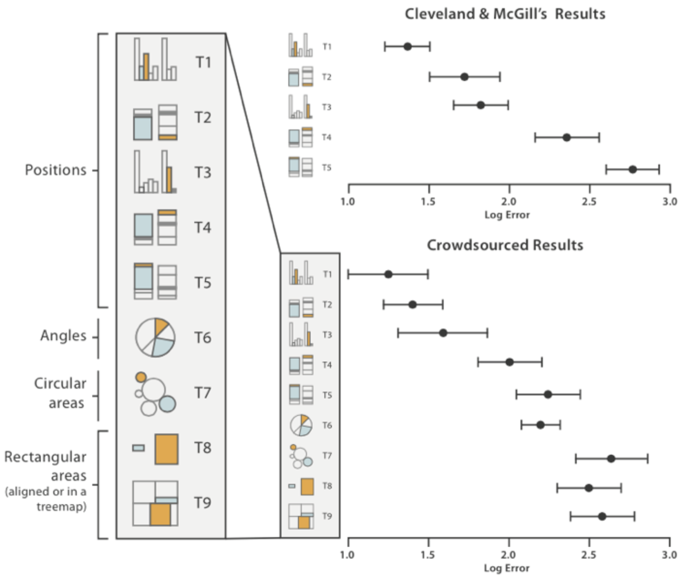

#Assignment 3 - Replicating a Classic Experiment

By Congyang Wang --- 2017/02/01

*Assignment 3: In this assignment I implemented a simple controlled experiment using some of the visualizations I've been building this semester.*

* Color vs No Color
* Up down vs Left right
* Big size vs Small size

http://codementum.org/cleveland-mcgill/
http://stackoverflow.com/questions/2450954/how-to-randomize-shuffle-a-javascript-array
http://bl.ocks.org/keithcollins/a0564c578b9328fcdcbb
http://bl.ocks.org/d3noob/473f0cf66196a008cf99
http://www.w3schools.com/css/css3_buttons.asp
https://greenmzc.github.io/2016/11/07/D3-js上手——饼状图/

> On page load, a semi-random 5-digit dataset is generated. Datasets are generated using the same algorithm that Cleveland and McGill used in their study.
Currently, the best way to extract the charts is to use SVG Crowbar from Shan Carter.

###Controlled experiments!

**code** with Javascript buttons and forms.: 
 - experiment sequence
 - results file output
 - experiment components

Goals: 
a) **test** three competing visualizations, 
b) **implement** data generation and error calculation functions from Cleveland and McGill's 1984 paper, 
c) run the experiment with 10 participants
d) do some basic analysis and **reporting of the results**.

For this assignment you should write everything from scratch
**Reference** demo programs from books or the web

Teams
If you have a teammate, add a **Collaboration** section with a single paragraph describing what aspects each of you contributed to the most.

###Requirements

*  Trials are in **random** **order**.  
*  Each trial has a **randomly** **generated** set of 10 data points.
*  **Two** of these data points are **marked**.  
* Implement the data generation code **as described in the Cleveland & McGill paper**. 
    - The goal is to generate 10 random data points (values should be between 0 and 100) and to mark two of them for comparison in the trial. 
- Add 3 of your (hopefully) existing visualizations to the experiment. When you are adding these visualizations, think about *why* these visualizations are interesting to test. In other words, keep in mind a *testable hypothesis* for each of the added visualization. ??
- Some good options include your bar charts, pie charts, stacked-bar charts, and treemaps. You can also rotate your bar chart to be horizontal or upside-down as one of your visualizations. You are encouraged to test unorthodox charts -- like radar charts.
    - Follow the style from Cleveland and McGill **closely** (i.e. no color) unless you are specifically testing a hypothesis (i.e. color versus no color). Pay attention to spacing between bars. Do not mark bars for comparison using color-- this makes the perceptual task too easy.
- After each trial, implement **code that grades and stores** participant’s responses.
- At the end of the experiment, use **Javascript to show the data** from the current experiment\* (i.e. a comma separated list in a text box) and copy it into your master datafile. See the Background section below for an example of what this file should look like. (\*Alternately implement a server, if you're experienced with that sort of thing.)

- **Figure out how to calculate "Error"**, the difference between the true percentage and the reported percentage.
    - Scale using log-base-2 error. 
    - For details, see the background section (there’s a figure with the equation). 
    - This becomes your “Error” column in the output. Make sure you use whole percentages (not decimal) in the log-base-2 equation. Make sure you handle the case of when a person gets the exact percentage correct
    -  (log-base-2 of 1/8 is -3, it is better to set this to 0).

- Run at least 20 trials per visualization type. If you have 3 visualizations, run at least 60 random trials.
- **Bonus**: if you implement a [Latin Square design](http://en.wikipedia.org/wiki/Latin_square) to ensure that the 60 trials are counterbalanced, we’ll give you a bonus.

- Make sure to save the resulting CSV after each participant. 
    - Compile the results into a master csv file (all participants, all trials).

- Produce a README with figures that shows the visualizations you tested and results, ordered by best performance to worst performance.

- To obtain the ranking, calculate and report the average Error for each visualization across all trials and participants. This should be straightforward to do in a spreadsheet.

- Use Bootstrapped **95% confidence intervals** for your error upper and lower bounds. Include these in your figures. Bootstrapped confidence intervals are easily implemented in **R**. 

- Include example images of each visualization as they appeared in your experiment (i.e. if you used a pie chart show the actual pie chart you used in the experiment along with the markings, not an example from Google Images).

###General Requirements

1. Your code should be forked from the GitHub repo and linked using **GitHub pages**.
2. Your project should **use d3** to build visualizations. 
3. Your writeup (readme.md in the repo) should contain the following:

- Concise description and screenshot of your experiment.
- Description of the technical and design achievements you attempted with this project.

###Background

In 1984, William Cleveland and Robert McGill published the results of several controlled experiments that pitted bar charts against pies and stacked-bar variants. 

By the end of the study, Cleveland and McGill had amassed a large dataset that looked like this:

**Log-base-2 or "cm-error"**: The true percent is the actual percentage of the smaller to the larger, while the reported percent is what participants reported. 
Cleveland and McGill recognized that their analyses would be biased if they took `abs(ReportedPercent – TruePercent)` as their score for error. 
To compensate, they came up with a logarithmic scale for error with this equation:

**You’ll be implementing this error score as part of the lab.**

(Hint: it’s not a trick question, this is just to familiarize you with the experiment protocol). 
With this Cleveland-McGill error score you can better compare the performance of the charts you test to figure out which one performs the best.

As a baseline, compare your average Error scores to the following chart, which include both Cleveland and McGill’s results as well as more recent extensions of this experiment (lower error indicates better performance, and error bars are bootstrapped 95% confidence intervals (`http://en.wikipedia.org/wiki/Confidence_interval#Meaning_and_interpretation`)):

