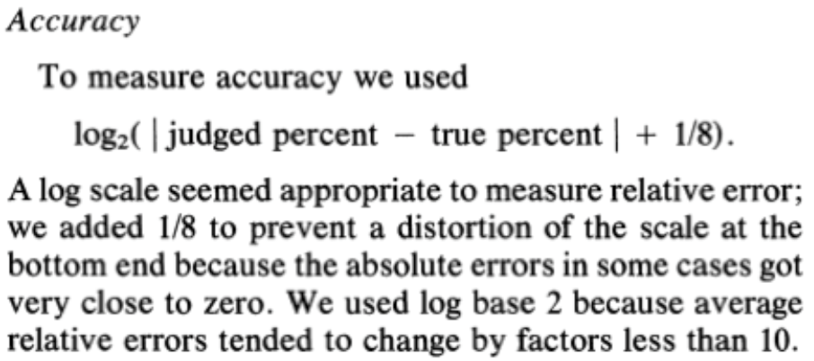

#Assignment 3 - Replicating a Classic Experiment

By Congyang Wang --- 2017/02/01

*Assignment 3: In this assignment I implemented a simple controlled experiment using some of the visualizations I've been building this semester. This experiment is based on the classic paper *([Download Link](http://www.math.pku.edu.cn/teachers/xirb/Courses/biostatistics/Biostatistics2016/GraphicalPerception_Jasa1984.pdf))*  published in 1984 written by Cleveland & McGill *  
**Link:** http://coyawa.github.io/03-Experiment

* Color vs No Color
* Up down vs Left right
* Big size vs Small size

##Description:

**Background:**   
On page load, a semi-random 5-digit dataset is generated. Datasets are generated using the same algorithm that Cleveland and McGill used in their study.generate 10 random data points (values should be between 0 and 100) and to mark two of them for comparison in the trial

The Experiment On-boarding Page:

---  
Pie/Tree/Bar Charts Page:


**Goals:**
Controlled experiments!
a) **test** three competing visualizations, 
b) **implement** data generation and error calculation functions from Cleveland and McGill's 1984 paper, 
c) run the experiment with 10 participants
d) do some basic analysis and **reporting of the results**.

**Why**
 *why* these visualizations are interesting to test.
 
- At the end of the experiment, use **Javascript to show the data** from the current experiment\* (i.e. a comma separated list in a text box) and copy it into your master datafile. 

**Analysis**   

First, I use python to combine the 10 .csv experiment results.
from glob import glob
 

```Python  
from glob import glob

with open('a3_par_all.csv', 'a') as singleFile:
    for csv in glob('*.csv'):
        if csv == 'a3_par_all.csv':
            pass
        else:
            for line in open(csv, 'r'):
                singleFile.write(line)
```

    -  (log-base-2 of 1/8 is -3, it is better to set this to 0).

1. order: Best to Worst


- To obtain the ranking, calculate and report the average Error for each visualization across all trials and participants. This should be straightforward to do in a spreadsheet.

- Use Bootstrapped **95% confidence intervals** for your error upper and lower bounds. Include these in your figures. Bootstrapped confidence intervals are easily implemented in **R**. 

- Include example images of each visualization as they appeared in your experiment (i.e. if you used a pie chart show the actual pie chart you used in the experiment along with the markings, not an example from Google Images).

###General Requirements

1. Your code should be forked from the GitHub repo and linked using **GitHub pages**.
2. Your project should **use d3** to build visualizations. 
3. Your writeup (readme.md in the repo) should contain the following:

- Concise description and screenshot of your experiment.
- Description of the technical and design achievements you attempted with this project.

###Background

In 1984, William Cleveland and Robert McGill published the results of several controlled experiments that pitted bar charts against pies and stacked-bar variants. 

By the end of the study, Cleveland and McGill had amassed a large dataset that looked like this:


**Log-base-2 or "cm-error"**: The true percent is the actual percentage of the smaller to the larger, while the reported percent is what participants reported. 
Cleveland and McGill recognized that their analyses would be biased if they took `abs(ReportedPercent – TruePercent)` as their score for error. 
To compensate, they came up with a logarithmic scale for error with this equation:




**You’ll be implementing this error score as part of the lab.**

(Hint: it’s not a trick question, this is just to familiarize you with the experiment protocol). 
With this Cleveland-McGill error score you can better compare the performance of the charts you test to figure out which one performs the best.

As a baseline, compare your average Error scores to the following chart, which include both Cleveland and McGill’s results as well as more recent extensions of this experiment (lower error indicates better performance, and error bars are bootstrapped 95% confidence intervals (`http://en.wikipedia.org/wiki/Confidence_interval#Meaning_and_interpretation`)):


##Technical and Design Achievement
* 1Trials are in **random** **order**. 
* 2 One participate do 60 times, there is a reason, 
* Error defined Scale using log-base-2 error. 
* Run at least 20 trials per visualization type. If you have 3 visualizations, run at least 60 random trials.

##For Me

I learn a lot from this little project 
**Bonus**: if you implement a [Latin Square design](http://en.wikipedia.org/wiki/Latin_square) to ensure that the 60 trials are counterbalanced, we’ll give you a bonus.  
At the end of the experiment, use **Javascript to show the data** from the current experiment

**Reference:**   
http://codementum.org/cleveland-mcgill/  
http://stackoverflow.com/questions/2450954/how-to-randomize-shuffle-a-javascript-array  
http://bl.ocks.org/keithcollins/a0564c578b9328fcdcbb  
http://bl.ocks.org/d3noob/473f0cf66196a008cf99  
http://www.w3schools.com/css/css3_buttons.asp  
https://greenmzc.github.io/2016/11/07/D3-js上手——饼状图/   
https://leanpub.com/D3-Tips-and-Tricks  
http://blog.devdon.com/?p=3229  


